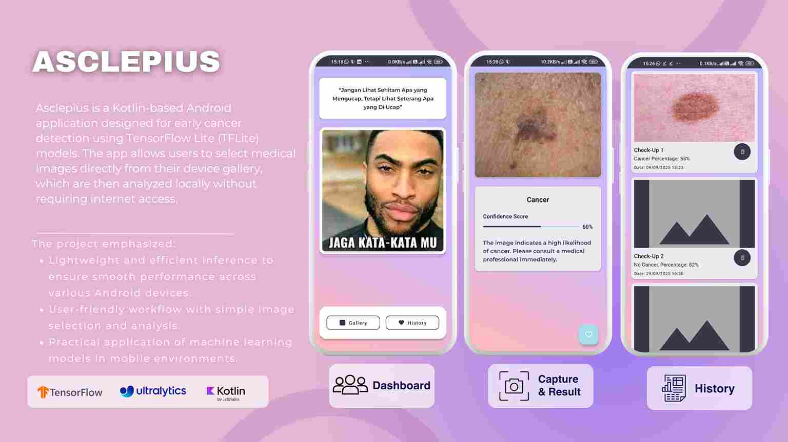

# Asplecius 🩺

Asplecius adalah aplikasi Android sederhana yang menunjukkan kekuatan *on-device machine learning* menggunakan TensorFlow Lite (TFLite). Aplikasi ini memungkinkan pengguna untuk memilih gambar dari galeri perangkat mereka dan kemudian memprosesnya menggunakan model TFLite yang telah diintegrasikan. Proyek ini bertujuan untuk menjadi contoh dasar dan titik awal bagi para pengembang yang tertarik untuk menjelajahi TFLite di Android.



## ✨ Fitur

* **Pilih Gambar dari Galeri**: Pengguna dapat dengan mudah menelusuri galeri foto mereka dan memilih gambar untuk dianalisis.
* **Inferensi TFLite**: Melakukan inferensi *offline* langsung di perangkat menggunakan model TensorFlow Lite (`.tflite`).
* **Antarmuka Sederhana**: UI yang bersih dan minimalis untuk memastikan kemudahan penggunaan.
* **Ringan**: Dibangun hanya dengan fungsionalitas inti untuk menjaga agar aplikasi tetap kecil dan efisien.

---

## 🛠️ Teknologi yang Digunakan

* **Bahasa**: Kotlin
* **Toolkit**: Android SDK
* **Machine Learning**: TensorFlow Lite

---

## 🚀 Memulai

Untuk menjalankan proyek ini di lingkungan pengembangan Anda, ikuti langkah-langkah di bawah ini.

### Prasyarat

* Android Studio (versi terbaru direkomendasikan)
* Perangkat Android atau Emulator dengan API level 21+

### Instalasi

1.  **Clone repositori ini:**
    ```bash
    git clone [https://github.com/NAMA_USER_ANDA/asplecius.git](https://github.com/NAMA_USER_ANDA/asplecius.git)
    ```
2.  **Buka proyek di Android Studio:**
    * Pilih `File` > `Open`
    * Arahkan ke direktori tempat Anda meng-clone proyek, lalu klik `OK`.
3.  **Sinkronkan Proyek:**
    Tunggu hingga Gradle selesai membangun dan menyinkronkan proyek.
4.  **Jalankan Aplikasi:**
    Pilih target perangkat (emulator atau perangkat fisik) dan klik tombol `Run` (▶️).

---

## 📖 Cara Menggunakan

1.  Buka aplikasi Asplecius.
2.  Ketuk tombol **"Pilih Gambar"** atau ikon galeri.
3.  Pilih gambar yang Anda inginkan dari galeri perangkat Anda.
4.  Aplikasi akan memproses gambar menggunakan model TFLite dan menampilkan hasilnya di layar.

